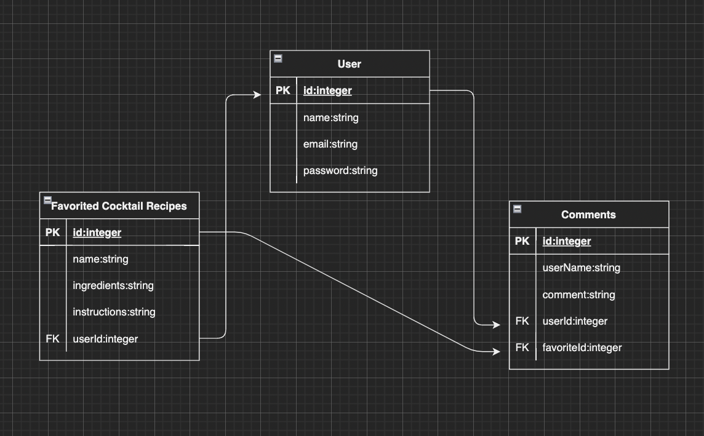
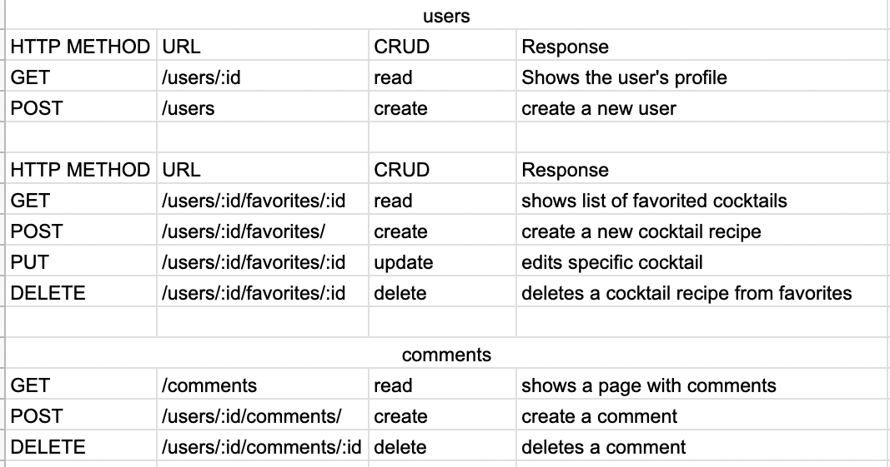

# Project 2

## Project description 
Tired of 

## Tech Stack:
* HTML
* Bootstrap
* CSS
* Javascript
* Axios
* Cookie Parser
* Crypto-JS
* Dotenv
* Express
* EJS
* Postgres
* Sequelize

## API 
I will be using this API https://api-ninjas.com/api/cocktail 

Sample implementation:
const url = 'https://api.api-ninjas.com/v1/cocktail?name=mezcal mule'
const config = { headers: { X-Api-Key: API_KEY}}

axios.get(url, config)

## ERDS

## Restful Routing Chart

## Wireframes

## User Stories
As a user, I want to be able to 

## MVP Goals

## Stretch Goals

