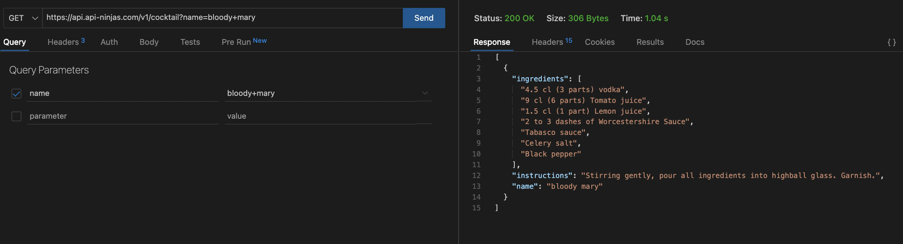

# Project 2
Project Link: https://cocktail-api-project2.herokuapp.com/ 

## Installation Instructions
* To use this project locally, fork and clone this repository. 
* Next, in your terminal, go to the locally-cloned repository and run `npm init -y` 
* Open the repo and navigate to `package.json` file and see a list of npm packages listed under `dependencies`
* Run `npm i` in the terminal to download all the required npm packages. `node_modules` should appear in the folder
* Check to see if `node_modules` and `.env` are in the `.gitignore` file before committing to the remote repository. If not, run the commands `echo node_modules >> .gitignore` and `echo .env >> .gitignore` 
* Then go to https://api-ninjas.com/ and sign up for an account. Afterwards, go to `My Account`, copy the API key, then create a variable called `API_KEY` in the `.env` and paste the API key there. Example: `API_KEY='[API key is pasted here, do not include the square brackets]'`
* Run the following commands: `sequelize db:create` then `sequelize db:migrate`
* To view the databases, run `psql` in your terminal
* Then run `nodemon` in your terminal and type in localhost:8000 in your browser

## Project description 
Tired of spending too much money at the bar? Want to save some money and potentially pick up bartending as a hobby? With this new app, you can! This app displays recipes for different cocktails and allows you to favorite cocktails you like. 

## Tech Stack:
* HTML
* Bootstrap
* CSS
* JavaScript
* Axios
* Bcrypt
* Cookie Parser
* Crypto-JS
* Dotenv
* Express
* EJS
* PostgresQL
* Sequelize and Sequelize-Cli
* Method-Override
* pg

## API 
I will be using this API https://api-ninjas.com/api/cocktail 

Sample implementation:
const url = 'https://api.api-ninjas.com/v1/cocktail?name=mezcal+mule'  
const config = { headers: { X-Api-Key: API_KEY}}

axios.get(url, config)

## ERDS

## Restful Routing Chart

## Wireframes

## Example Pull Request 

## User Stories
As a user, I want to be able to:
* view the user profile
* create a new profile
* add cocktail recipes to a favorites page
* add comments 

## MVP Goals
* Render a home page with functioning search bar/option that pulls from an API database and displays the search results 
* Render a favorites page with favorited cocktails by the user, with the option to delete from the favorites page
* Render a sign up page where new users can create new profiles
* Render a comment section 

## Stretch Goals
* Use CSS properties to make the app look more visually appealing 
* render results to a results page instead of on the home page
* add an ability for logged in users to edit and customize the recipes they favorite and only after the users favorite the recipe
* add ability to edit or delete comments 

## Post-Project Reflections
Overall, I am happy with how this project turned out considering how difficult it was to create. It's not perfect by any means and I am content with that because this is currently what I can achieve with my abilities. That said, I would like to give a shoutout to everyone who helped me with this project because I would not have been able to do this without them.  
I felt that I was able to better understand the concepts covered in Unit 2 as a result of this project because I wasn't very solid on the concepts of routes and now I better understand the concepts behind creating routes. One area I had an unsolved problem was the styling of the individual cards within the forEach loops. I was unable to figure out how to style the cards so that they could render in rows of 5. Another problem that was unresolved was figuring out how to differentiate which favorite list belongs to which user. As it stands the favorites list is is the same regardless of who signs in. 

## Sources
https://api-ninjas.com/  
https://getbootstrap.com/docs/5.0/getting-started/introduction/ 
